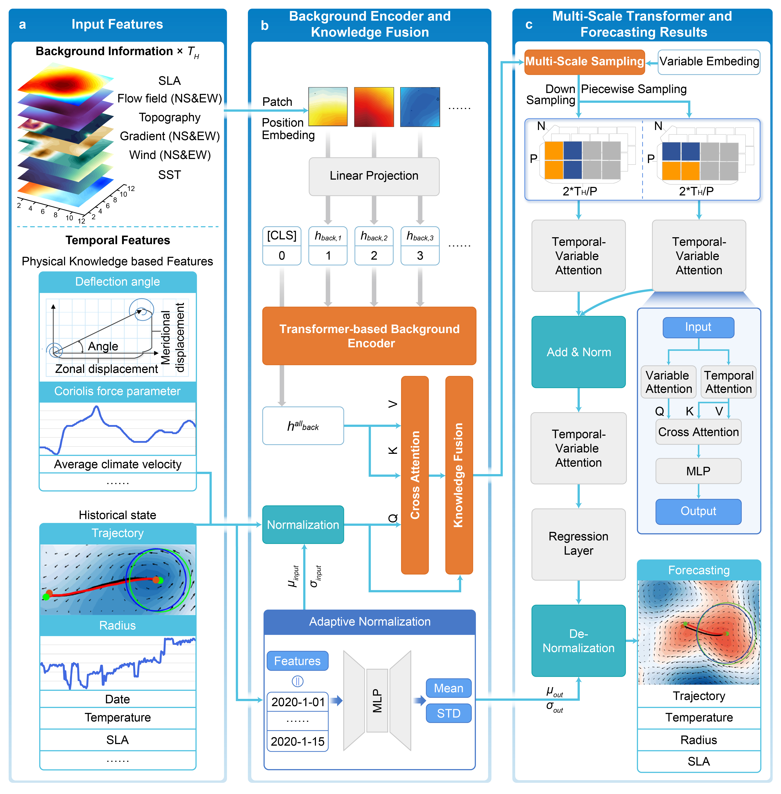

# Code for the proposed model: GC-EdCastX

This model effectively integrates temporal features and background field information to achieve global mesoscale eddy forecasting.

The processed dataset needs to undergo relevant reviews before it can be made publicly available. Currently, we mainly provide model files.

## The hyperparameters of our model
1. input_len: The length of historical observations 
2. output_len: The length of future value
3. num_id: number of temporal features
4. input_size: 3 (It represents the dimensions after concatenating the original time series with the two temporal embeddings, set to 3.)
5. back_size: The size of the background information
6. hiden_size: The hidden dimension of the background encoder
7. num_layer: The number of Multi-scale Transformer layer
8. vit_layer: the number of background encoder layer
9. dropout
10. muti_head: the number of multi-head attention
11. num_samp: The frequency of multi-scale sampling
12. IF_node: Whether to use variable embedding
13. IF_REVIN: Whether to use adaptive normalization

## License
This project is licensed under the MIT License - see the (https://github.com/ChengqingYu/GC-EddyCastX/blob/main/LICENSE) file for details.
